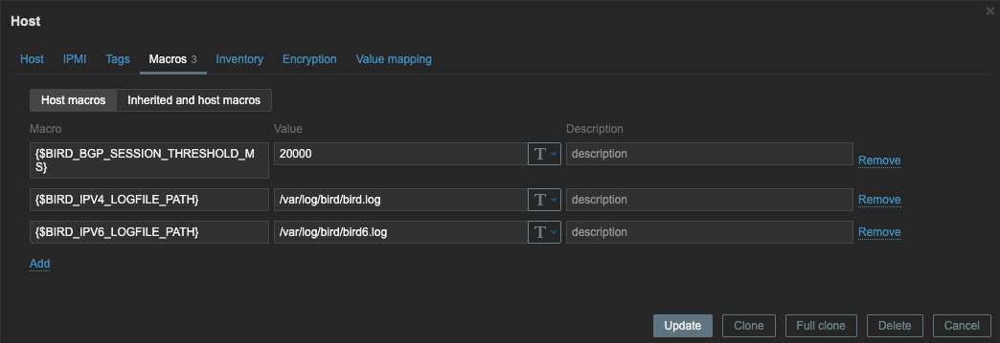

# BIRD Monitoring on Zabbix

This repository contains the necessary files for monitoring BIRD using Zabbix. It focuses on tracking the I/O time and events of the BIRD daemon and visualizing the data through Zabbix graphs.

Example of I/O related log output:
```plaintext
2024-05-14 12:26:07 <WARN> I/O loop cycle took 5720 ms for 47 events
```
Get the above `5720 ms` and `47 events` values and create a graph.

## Installation
### BIRD Configuration
To enable logging, add the following lines to your BIRD configuration files (`bird.conf` and `bird6.conf`):
```plaintext
log [path to log file] all;
debug latency on;
debug latency limit 1s;
```

For example:
```plaintext
log "/var/log/bird/bird.log" all;
debug latency on;
debug latency limit 1s;
```

### Zabbix Plugin
Place the `bird.conf` file from this repository into the following directory on your Zabbix server:
```plaintext
/etc/zabbix/zabbix_agent2.d/plugins.d
```
Zabbix agent must be restarted after installing the file:
```plaintext
systemctl restart zabbix-agent2
```

### Zabbix Template
Import the `template_app_bird_agent2.yaml` file from this repository as a Zabbix template. This can be done via the Zabbix dashboard:

1. Navigate to `Configuration > Templates`.
2. Click the `Import` button.
3. Select the `template_app_bird_agent2.yaml` file and import it.

### Zabbix Macros
Next, set up the following Zabbix macros for your environment:

- `$BIRD_IPV4_LOGFILE_PATH`: Full path to the log file for the IPv4 daemon.
- `$BIRD_IPV6_LOGFILE_PATH`: Full path to the log file for the IPv6 daemon.
- `$BIRD_BGP_SESSION_THRESHOLD_MS`: Threshold value for alarms.



### Apply Template to Host
Finally, apply the template to the host where BIRD is running:

1. Navigate to `Configuration > Hosts` in the Zabbix dashboard.
2. Select the host where BIRD is running.
3. Go to the `Templates` tab.
4. Click `Add` and select the `Template App BIRD by Zabbix agent2 active`.
5. Click `Update` to apply the template to the host.

## Tested version
This program has been tested and verified in the following environment:

- **BIRD**: 2.0.8
- **Zabbix server**: 6.0.29
- **Zabbix agent 2**: 6.0.27
- **Red Hat Enterprise Linux Server**: 7.9 (Maipo)
